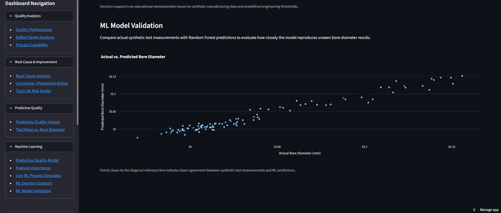

# Manufacturing Quality Analytics Dashboard

An interactive manufacturing quality engineering dashboard built with Python and Streamlit. This portfolio project demonstrates how inspection data, statistical quality tools, root cause analysis, predictive analytics, and machine learning can be integrated into a manufacturing decision-support workflow.

> **Note:** All manufacturing and machine-learning data used in this project are synthetic and created for educational and portfolio demonstration purposes.
## Dashboard Preview


## Project Overview

The dashboard follows a manufacturing quality problem from detection through analysis, corrective action, prediction, and model validation.

**Quality Inspection → Pareto Analysis → SPC & Process Capability → Root Cause Analysis → CAPA → Tool-Life Management → Predictive Quality → Machine Learning → Decision Support → Model Validation**

## Key Features

- Interactive manufacturing quality KPI dashboard
- Defect Pareto analysis with cumulative percentage
- Statistical Process Control (SPC) with 3-sigma out-of-control detection
- Cp / Cpk process capability and Pp / Ppk long-term performance indices
- Cpm (Taguchi) target-aware capability index driven by the Target Diameter input
- What-If specification analysis
- 5 Whys root cause analysis
- Corrective and Preventive Action (CAPA) tracking
- Interactive cutting-tool life risk model
- Predictive bore-diameter quality analysis
- Tool wear vs. dimensional performance visualization
- Random Forest regression model
- Machine-learning feature importance
- Live ML process simulator
- ML-driven production decision support
- Actual vs. predicted model validation

## Machine Learning

The project uses a Random Forest regression model trained on reproducible synthetic CNC manufacturing data.

Model inputs include:

- Tool cycles
- Spindle speed
- Feed rate
- Vibration
- Process temperature

The model predicts bore diameter and demonstrates how machine learning can support proactive quality decisions before dimensional variation results in nonconforming product.

## Quality Engineering Methods

The dashboard incorporates several commonly used manufacturing quality concepts:

- Pareto Analysis
- Statistical Process Control
- Cp / Cpk, Pp / Ppk and Cpm (Taguchi) capability & performance indices
- Root Cause Analysis
- 5 Whys
- CAPA
- Preventive controls
- Tool-life management
- Predictive quality
- Machine-learning model validation

## Project Structure

```
app.py            Streamlit entrypoint (run: `streamlit run app.py`)
quality_core.py   Pure, dependency-light quality-engineering calculations
                  (unit-tested, importable without a Streamlit runtime)
tests/            pytest suite: quality_core unit tests + an end-to-end
                  Streamlit AppTest smoke test
```

The statistics that used to live inline in `app.py` have been extracted into
`quality_core.py` so they can be unit-tested and reused without launching a
browser.  Only the one-off synthetic ML dataset factory requires NumPy, and it
seeds a private random generator instead of mutating NumPy's global state.

## Running the tests

```bash
pip install -e ".[dev]"   # installs pytest + ruff plus the app dependencies
python -m pytest tests/   # all tests pass
ruff check .
```

The suite covers every metric the dashboard renders (defect rate, Pareto,
SPC limits, Cp/Cpk, Pp/Ppk, Cpm, tool-life bands, ML decision priority) plus a
headless `AppTest` run that executes the whole dashboard and asserts the page
renders without exceptions.

## Technology Stack

- Python
- Streamlit
- Pandas
- NumPy
- Plotly
- Scikit-learn
- Random Forest Regression

## Purpose

This project was developed as a hands-on demonstration of combining traditional manufacturing quality engineering methods with modern data analytics and machine learning.

The goal is not to replace engineering judgment, but to demonstrate how data-driven tools can help identify risk, investigate root causes, prioritize corrective actions, and support manufacturing decisions.

## Disclaimer

This application is an educational simulation. All inspection records, process measurements, machine conditions, defects, CAPA records, and machine-learning results are synthetic and should not be interpreted as actual production data or validated manufacturing limits.
